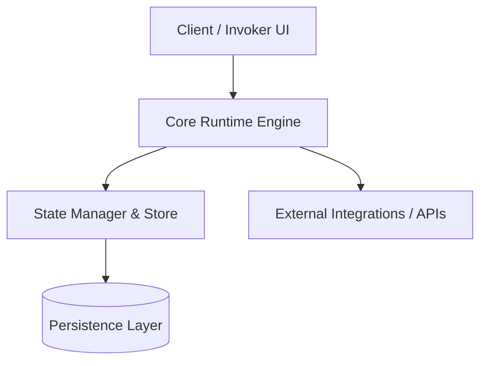

# Architecture Specification: CorpAI Standard & Playbooks

## 1. System Overview & Domain Boundaries
`CorpAI` operates as an active component within the ecosystem, providing open standard for autonomous ai agent organizations and role definitions.

---

## 2. Core Architecture & Data Flow

---

## 3. Subsystem Modules & Responsibilities
- **Core Engine**: Handles lifecycle orchestration, request execution, and error recovery.
- **State Store**: Maintains in-memory and persisted session states.
- **Service Adapters**: Encapsulates external API communication and network retries.

---

## 4. Invariant Rules & Quality Standards
- Strict type safety and zero unhandled exceptions.
- Deterministic state transitions with telemetry logging.
