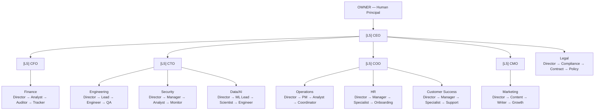

# CorpAI

[](CHANGELOG.md)
[](LICENSE)
[](https://pypi.org/project/corpai/)
[](https://github.com/Arigitshub/CorpAI/stargazers)
[](BADGE.md)

**The open standard for AI agent organizations** — define, validate, and deploy AI teams with ranked roles, communication protocols, and escalation rules.

No framework lock-in. No library required. Just markdown — implementable in any language, on any platform, with any LLM.

---

## Get Started in 3 Steps

```bash
# 1. Install the CLI
pip install corpai

# 2. Clone the spec
git clone https://github.com/Arigitshub/CorpAI && cd CorpAI

# 3. Validate and explore
corpai lint          # validate all 46 roles
corpai graph         # visualize the org tree
corpai info          # org summary
```

---

## The Hierarchy



Full charts → [spec/diagrams/org-chart.md](spec/diagrams/org-chart.md)

---

## Why CorpAI

- **Language-agnostic** — the spec is markdown. Implement it in Python, TypeScript, Go, or whatever you ship in.
- **Production-ready structure** — 46 defined roles across 10 departments, with ranks (L1–L5), escalation rules, and cross-department protocols baked in.
- **CLI-validated** — `corpai lint` catches broken chains, missing fields, and spec violations before you deploy.

---

## The Ecosystem

| Repo | What it is |
|---|---|
| [CorpAI](https://github.com/Arigitshub/CorpAI) | The spec — this repo |
| [corpai-cli](https://github.com/Arigitshub/corpai-cli) | CLI to lint, visualize, simulate (`pip install corpai`) |
| [corpai-runtime](https://github.com/Arigitshub/corpai-runtime) | Provider-agnostic agent execution engine |
| [corpai-portal](https://github.com/Arigitshub/corpai-portal) | Interactive org chart dashboard |

---

## What's in the Spec

| File | What it defines |
|---|---|
| [spec/ranks.md](spec/ranks.md) | L1–L5 rank system |
| [spec/communication.md](spec/communication.md) | Message types, format, priority levels |
| [spec/escalation.md](spec/escalation.md) | Escalation triggers and OWNER notifications |
| [spec/lifecycle.md](spec/lifecycle.md) | Agent lifecycle: Proposed → Active → Decommissioned |
| [spec/cross-department.md](spec/cross-department.md) | How departments interact |
| [spec/multi-org.md](spec/multi-org.md) | Federation protocol for inter-org communication |
| [spec/message-examples.md](spec/message-examples.md) | Real message examples |
| [spec/glossary.md](spec/glossary.md) | Every term, defined |

### Roles (46 defined across 10 departments)

| Department | Roles |
|---|---|
| [Executive](roles/executive/) | OWNER, CEO, CFO, CTO, COO, CMO |
| [Engineering](roles/engineering/) | Director, Team Lead, Senior Engineer, Engineer, QA Lead, QA Tester |
| [Finance](roles/finance/) | Director, Financial Analyst, Auditor, Budget Tracker |
| [Marketing](roles/marketing/) | Director, Content Lead, Growth Specialist, Brand Strategist, Content Writer |
| [Operations](roles/operations/) | Director, Project Manager, Process Analyst, Coordinator |
| [Legal](roles/legal/) | Director, Compliance Specialist, Contract Reviewer, Policy Checker |
| [HR](roles/hr/) | Director, HR Manager, Talent Specialist, Onboarding Agent |
| [Security](roles/security/) | Director, Security Manager, Threat Analyst, Monitor Agent |
| [Data/AI](roles/data-ai/) | Director, ML Lead, Data Scientist, Data Engineer, Data Processor |
| [Customer Success](roles/customer-success/) | Director, CS Manager, Account Specialist, Support Agent |

---

## Implementing CorpAI?

Add the badge to your repo → [BADGE.md](BADGE.md)  
Apply for CorpAI Certified status → [CERTIFIED.md](CERTIFIED.md)

---

## Contributing

PRs and proposals welcome. Read [CONTRIBUTING.md](CONTRIBUTING.md) to add roles, propose spec changes, or submit a certified implementation.

[GitHub Discussions](../../discussions) — questions, ideas, proposals
