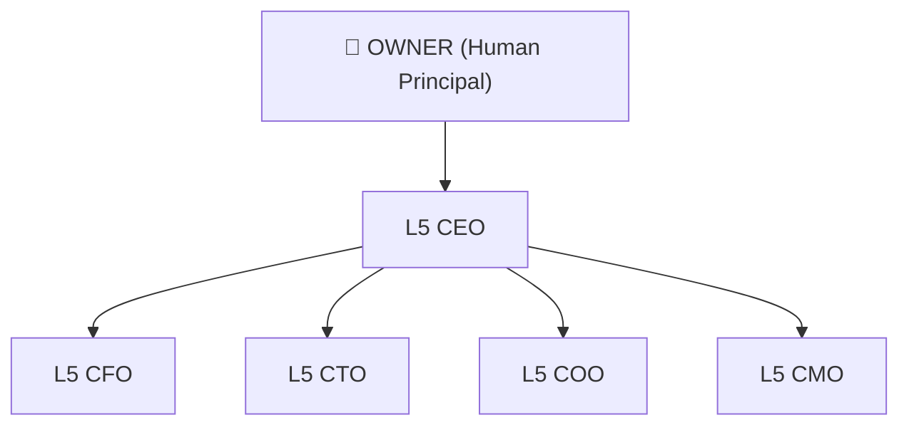

# CorpAI

> The open standard for AI agent organizations — a corporate hierarchy for your AI workforce, defining how agents delegate, communicate, and escalate.

---

## Imagine you have an AI company.

Not a chatbot. Not a single agent. A full organization — with a CEO that sets direction, a CTO that owns architecture, a CFO watching the budget, and hundreds of worker agents executing tasks below them.

Who tells who what to do?
How does a failure at L1 reach the OWNER?
What does a "task handoff" actually look like?

**CorpAI answers all of that.**

---

## The Org Chart

> Full org charts with all departments → [spec/diagrams/](spec/diagrams/)

---

## What's Inside

| Path | What it defines |
|---|---|
| [CODEX.md](CODEX.md) | The founding philosophy |
| [spec/ranks.md](spec/ranks.md) | L1–L5 rank system |
| [spec/communication.md](spec/communication.md) | How agents send and receive tasks |
| [spec/escalation.md](spec/escalation.md) | When and how agents escalate |
| [roles/executive/](roles/executive/) | C-suite role definitions |
| [templates/role-template.md](templates/role-template.md) | Add your own roles |
| [examples/real-world-mapping.md](examples/real-world-mapping.md) | Real-world analogy guide |

---

## Quick Start

1. Read the [CODEX.md](CODEX.md) — understand the philosophy
2. Study the [rank system](spec/ranks.md)
3. Browse the [executive roles](roles/executive/)
4. Copy the [role template](templates/role-template.md) to add your own
5. Check [CONTRIBUTING.md](CONTRIBUTING.md) to submit new roles

---

## CorpAI Compatible

Building something that implements this spec? Add the badge to your repo → [BADGE.md](BADGE.md)

---

## Community

- [GitHub Discussions](../../discussions) — questions, ideas, proposals
- [ROADMAP.md](ROADMAP.md) — where this is going
- [CONTRIBUTING.md](CONTRIBUTING.md) — how to add roles and departments
