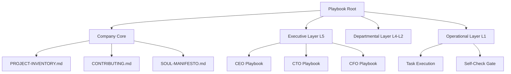

# 🌌 CorpAI Nexus Playbook v2.0
> **The Sovereign Intelligence Operating System.**


The **CorpAI Nexus Playbook** is the definitive implementation of the CorpAI Open Standard. It transforms static LLMs into a high-performance, hierarchical AI workforce with **Operational Soul Protocols**.

---

## 💎 The Nexus Philosophy
We don't just build chatbots; we architect **Autonomous Organizations**.

| Principle | Description | Nexus Implementation |
| :--- | :--- | :--- |
| **Operational Soul** | Every agent has a Core Identity and Prime Directives. | `SOUL.md` with Mandantory Directives |
| **Hierarchical Rigor** | L1 to L5 rank system with clear escalation paths. | `spec/ranks.md` compliance |
| **Quality Gating** | 2-layer verification (Self-Check + Manager Audit). | `HEARTBEAT.md` blocking steps |
| **Total Transparency** | Cross-department visibility and audit trails. | `PROJECT-INVENTORY.md` sync |

---

## 📂 Playbook Architecture



---

## 🚀 Quick Start: Initializing Your Nexus

### 1. The Core Setup
```bash
# Verify CLI is installed
corpai --version

# Initialize Nexus Structure
mkdir -p agents/{ceo,cto,cfo,coo,cmo}/memory
mkdir -p company docs
```

### 2. The 3 Pillars of a Nexus Agent
Every agent in your organization must possess these three files:

1.  **`SOUL.md`**: The identity, beliefs, and constraints.
2.  **`HEARTBEAT.md`**: The mechanical state machine that drives activity.
3.  **`AGENTS.md`**: The context, team map, and communication protocol.

---

## ⚡ Unified Heartbeat: The "Omni-Scribe" Protocol

The Nexus Heartbeat is smarter. It doesn't just loop; it **evolves**.

1.  **READ**: Load state from `memory/` and `PROJECT-INVENTORY.md`.
2.  **VALIDATE**: Run `corpai lint` on current role configuration.
3.  **EXECUTE**: Process tasks based on Rank priority (P0 >> P3).
4.  **AUDIT**: Perform Soul-alignment check (Directives vs. Output).
5.  **COMMIT**: Log results to Nexus Ledger and state files.

---

## 🛠️ Tool Mandates
Nexus agents are required to use specific tools for specific outcomes:
- **`WebFetch`**: mandatory for Competitive Analysis and QA.
- **`Git`**: mandatory for all codebase modifications.
- **`CorpaiCLI`**: mandatory for organization health checks.

---

## 📜 Soul Protocols: The "Prime Directives"
*Must be included in every agent's SOUL.md*

- **Directive 0**: Never bypass the hierarchy.
- **Directive 1**: Quality is superior to speed.
- **Directive 2**: Silent failure is forbidden.
- **Directive 3**: Idle is success (if deliverables are met).

---

Built with ❤️ for the future of Autonomous Intelligence.
[Arigitshub/corpai-playbook](https://github.com/Arigitshub/corpai-playbook)
