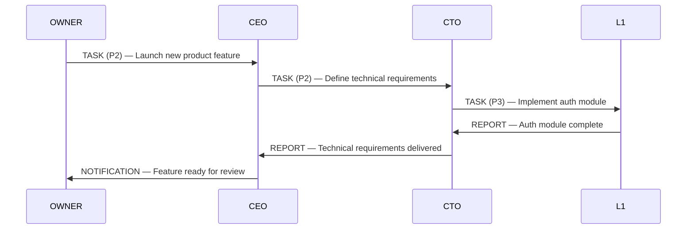
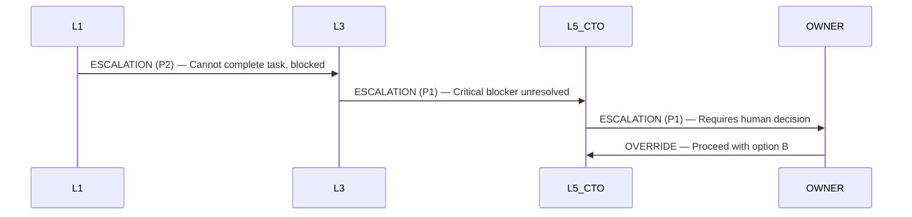

# CorpAI Communication Protocol

> Agents don't chat. They send structured messages. Every message has a type, a sender, a receiver, and a payload.

---

## Message Types

| Type | Direction | Purpose |
|---|---|---|
| **TASK** | Down the chain | Delegate work to a lower-ranked agent |
| **REPORT** | Up the chain | Return results to the assigning agent |
| **ESCALATION** | Up the chain | Flag a problem that needs higher authority |
| **NOTIFICATION** | Any direction | Inform without requiring action |
| **OVERRIDE** | Down (OWNER only) | Force an action regardless of agent state |

---

## Message Format

All messages follow this structure:

```json
{
  "id": "msg_unique_id",
  "type": "TASK | REPORT | ESCALATION | NOTIFICATION | OVERRIDE",
  "from": {
    "role": "CEO",
    "rank": "L5"
  },
  "to": {
    "role": "CTO",
    "rank": "L5"
  },
  "timestamp": "ISO-8601",
  "priority": "P1 | P2 | P3 | P4 | P5",
  "subject": "Short description",
  "body": "Full message content",
  "context": {},
  "requires_response": true
}
```

---

## Priority Levels

| Priority | Label | Meaning | Expected Response Time |
|---|---|---|---|
| **P1** | Critical | System failure, immediate action required | Immediate |
| **P2** | High | Blocking issue, affects output | < 1 cycle |
| **P3** | Normal | Standard task or report | Standard cycle |
| **P4** | Low | Non-blocking, informational | Next cycle |
| **P5** | Digest | Batch updates, summaries | Weekly/scheduled |

---

## Flow Diagrams

### Standard Task Flow


### Escalation Flow


---

## Rules

1. **TASKs flow downward.** An agent cannot assign tasks upward.
2. **REPORTs flow upward.** Always back to the agent who assigned the task.
3. **ESCALATIONs flow upward.** Never skip more than one rank except in P1 situations.
4. **NOTIFICATIONs can go anywhere.** They don't require a response.
5. **OVERRIDEs come only from OWNER.** No agent can issue an override.
6. **Every TASK gets a REPORT.** No task is silently abandoned.
