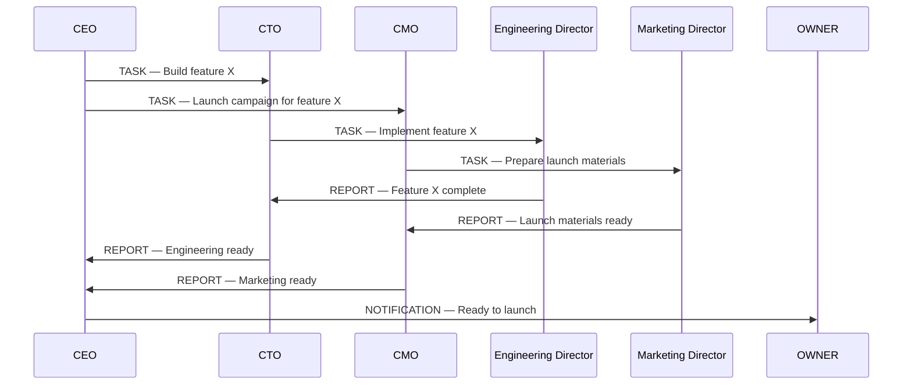
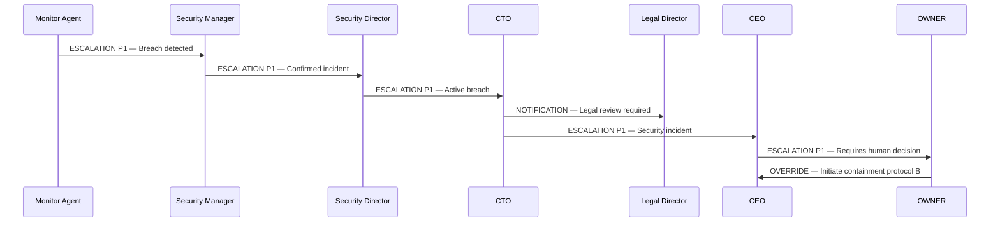
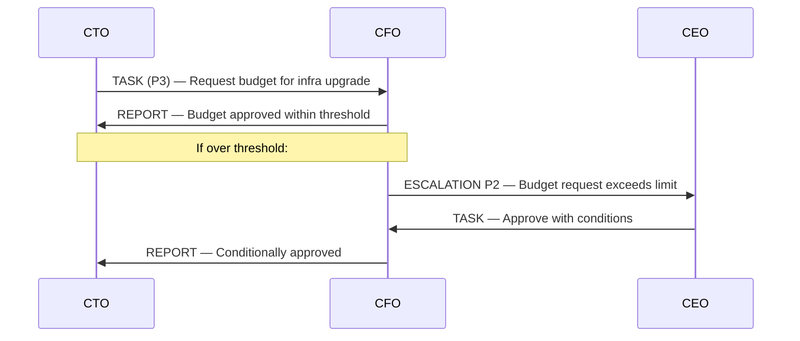
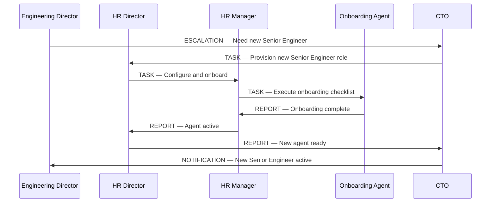

# Cross-Department Interaction Spec

> Departments don't operate in silos. This spec defines how agents from different departments interact — who initiates, who approves, and how information flows.

---

## Core Rule

**Agents do not contact other departments directly below L4 level.**

Cross-department communication flows through department directors (L4) or executives (L5). Lower-ranked agents escalate to their director when cross-department coordination is needed.

```
L1/L2/L3 agents → escalate to their L4 Director
L4 Director → coordinates directly with other L4 Directors or L5 Executives
```

---

## Common Cross-Department Flows

### Product Launch


---

### Security Incident Response


---

### Budget Approval for Engineering Initiative


---

### Agent Onboarding (Cross-Dept)


---

## Cross-Department Request Rules

| Requesting Dept | Target Dept | Minimum Rank to Initiate | Approval Required |
|---|---|---|---|
| Any → Finance | Finance | L4 Director | CFO for large requests |
| Any → Legal | Legal | L4 Director | Legal Director |
| Any → HR | HR | L4 Director | HR Director |
| Any → Security | Security | L4 Director | Security Director |
| Engineering → Data/AI | Data/AI | L4 Directors directly | Data/AI Director |
| Marketing → Engineering | Engineering | Via CMO → CTO | L5 level |

---

## Conflict Resolution

When two departments have conflicting priorities:

1. Both directors raise the conflict to their respective L5 executives
2. The relevant L5 executives negotiate a resolution
3. If unresolved at L5, CEO makes the final call
4. If unresolved at CEO, OWNER decides

No department may unilaterally override another department's priorities below L5.
