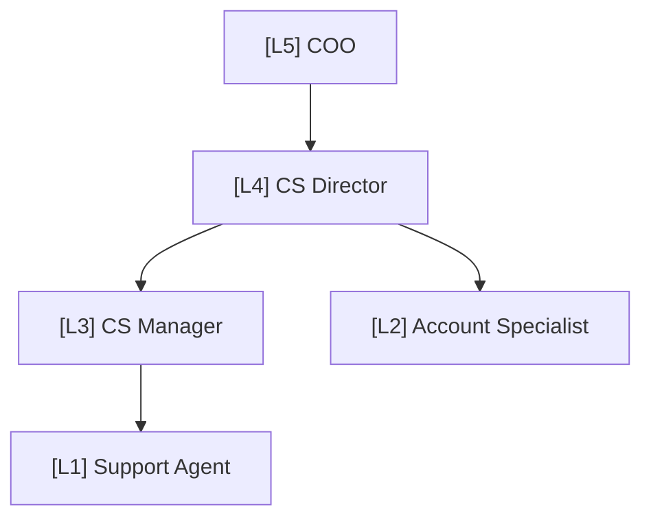

# Customer Success Department Org Chart

```mermaid
graph TD
    COO["[L5] COO"]
    CSD["[L4] CS Director"]
    CSM["[L3] CS Manager"]
    AS["[L2] Account Specialist"]
    SA["[L1] Support Agent"]

    COO --> CSD
    CSD --> CSM & AS
    CSM --> SA

    click COO "/roles/executive/coo.md"
    click CSD "/roles/customer-success/director.md"
    click CSM "/roles/customer-success/cs-manager.md"
    click AS "/roles/customer-success/account-specialist.md"
    click SA "/roles/customer-success/support-agent.md"
```
