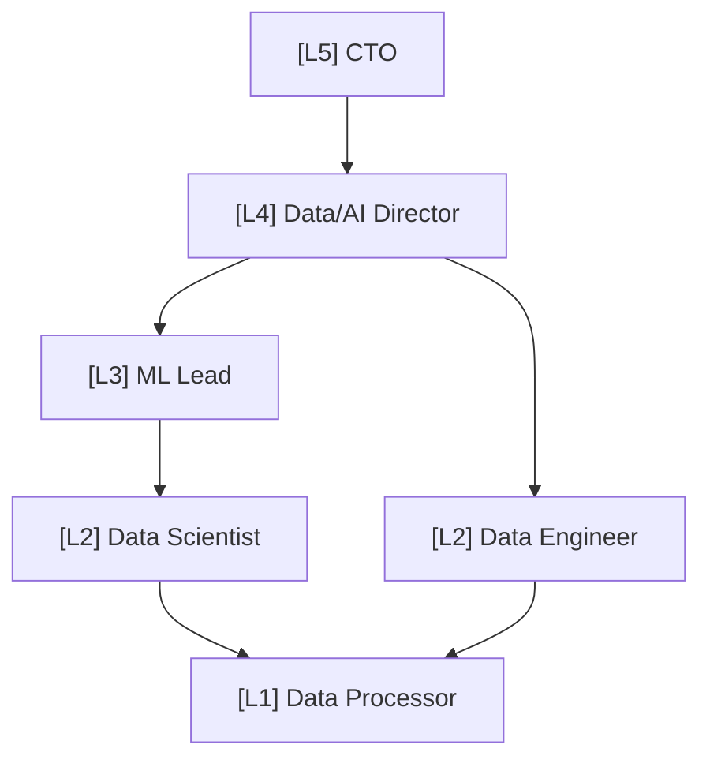

# Data/AI Department Org Chart

```mermaid
graph TD
    CTO["[L5] CTO"]
    DAD["[L4] Data/AI Director"]
    ML["[L3] ML Lead"]
    DS["[L2] Data Scientist"]
    DE["[L2] Data Engineer"]
    DP["[L1] Data Processor"]

    CTO --> DAD
    DAD --> ML & DE
    ML --> DS
    DS --> DP
    DE --> DP

    click CTO "/roles/executive/cto.md"
    click DAD "/roles/data-ai/director.md"
    click ML "/roles/data-ai/ml-lead.md"
    click DS "/roles/data-ai/data-scientist.md"
    click DE "/roles/data-ai/data-engineer.md"
    click DP "/roles/data-ai/data-processor.md"
```
