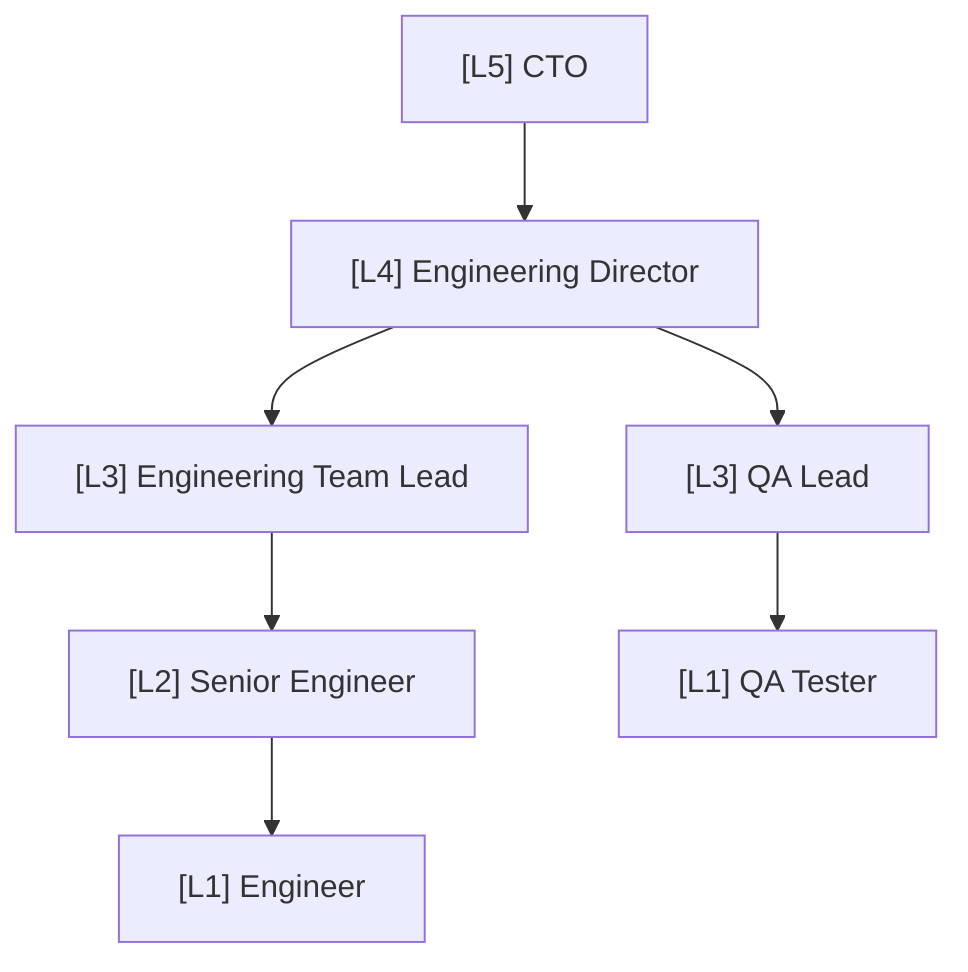

# Engineering Department Org Chart

```mermaid
graph TD
    CTO["[L5] CTO"]
    ED["[L4] Engineering Director"]
    TL["[L3] Engineering Team Lead"]
    QAL["[L3] QA Lead"]
    SE["[L2] Senior Engineer"]
    ENG["[L1] Engineer"]
    QAT["[L1] QA Tester"]

    CTO --> ED
    ED --> TL & QAL
    TL --> SE
    SE --> ENG
    QAL --> QAT

    click CTO "/roles/executive/cto.md"
    click ED "/roles/engineering/director.md"
    click TL "/roles/engineering/team-lead.md"
    click QAL "/roles/engineering/qa-lead.md"
    click SE "/roles/engineering/senior-engineer.md"
    click ENG "/roles/engineering/engineer.md"
    click QAT "/roles/engineering/qa-tester.md"
```
