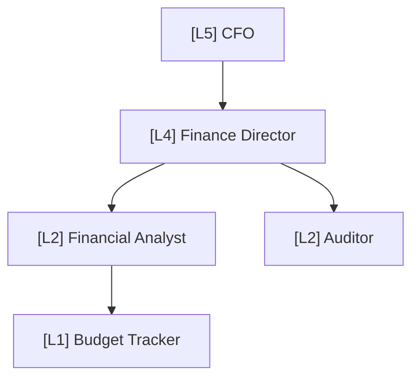

# Finance Department Org Chart

```mermaid
graph TD
    CFO["[L5] CFO"]
    FD["[L4] Finance Director"]
    FA["[L2] Financial Analyst"]
    AU["[L2] Auditor"]
    BT["[L1] Budget Tracker"]

    CFO --> FD
    FD --> FA & AU
    FA --> BT

    click CFO "/roles/executive/cfo.md"
    click FD "/roles/finance/director.md"
    click FA "/roles/finance/financial-analyst.md"
    click AU "/roles/finance/auditor.md"
    click BT "/roles/finance/budget-tracker.md"
```
