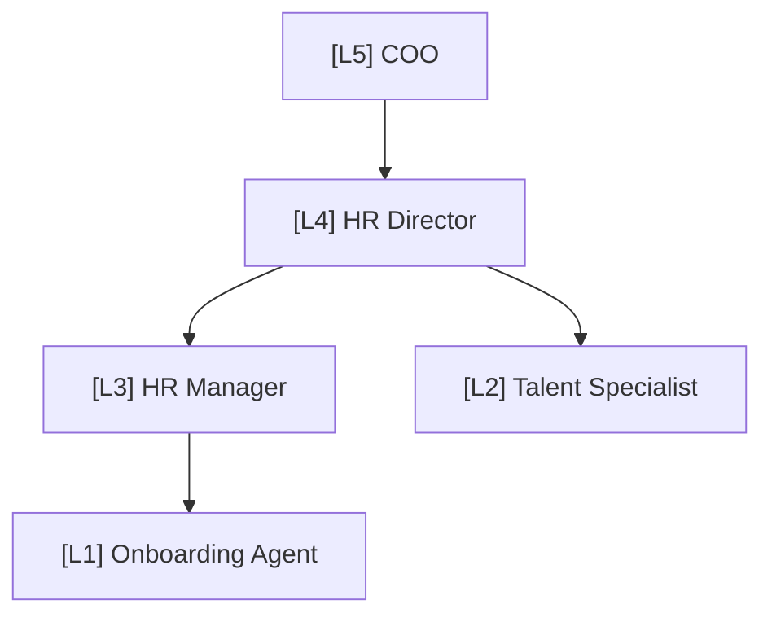

# HR Department Org Chart

```mermaid
graph TD
    COO["[L5] COO"]
    HRD["[L4] HR Director"]
    HRM["[L3] HR Manager"]
    TS["[L2] Talent Specialist"]
    OA["[L1] Onboarding Agent"]

    COO --> HRD
    HRD --> HRM & TS
    HRM --> OA

    click COO "/roles/executive/coo.md"
    click HRD "/roles/hr/director.md"
    click HRM "/roles/hr/hr-manager.md"
    click TS "/roles/hr/talent-specialist.md"
    click OA "/roles/hr/onboarding-agent.md"
```
