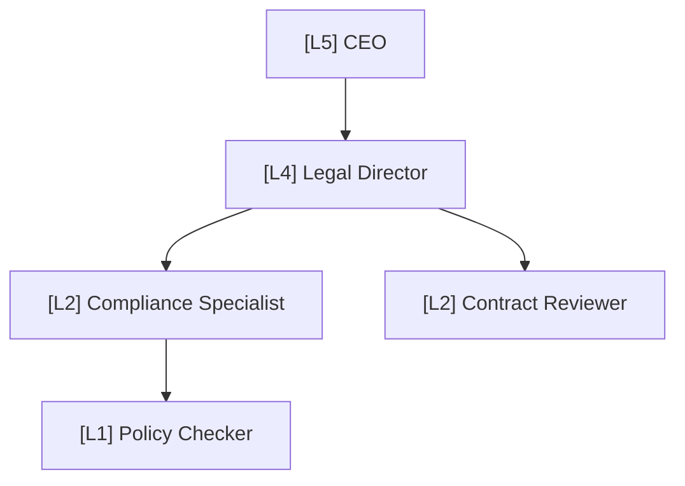

# Legal Department Org Chart

```mermaid
graph TD
    CEO["[L5] CEO"]
    LD["[L4] Legal Director"]
    CS["[L2] Compliance Specialist"]
    CR["[L2] Contract Reviewer"]
    PC["[L1] Policy Checker"]

    CEO --> LD
    LD --> CS & CR
    CS --> PC

    click CEO "/roles/executive/ceo.md"
    click LD "/roles/legal/director.md"
    click CS "/roles/legal/compliance-specialist.md"
    click CR "/roles/legal/contract-reviewer.md"
    click PC "/roles/legal/policy-checker.md"
```
