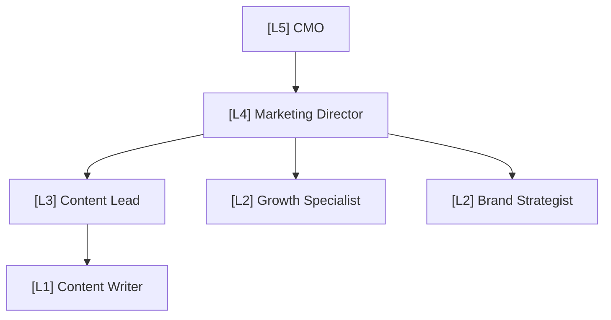

# Marketing Department Org Chart

```mermaid
graph TD
    CMO["[L5] CMO"]
    MD["[L4] Marketing Director"]
    CL["[L3] Content Lead"]
    GS["[L2] Growth Specialist"]
    BS["[L2] Brand Strategist"]
    CW["[L1] Content Writer"]

    CMO --> MD
    MD --> CL & GS & BS
    CL --> CW

    click CMO "/roles/executive/cmo.md"
    click MD "/roles/marketing/director.md"
    click CL "/roles/marketing/content-lead.md"
    click GS "/roles/marketing/growth-specialist.md"
    click BS "/roles/marketing/brand-strategist.md"
    click CW "/roles/marketing/content-writer.md"
```
