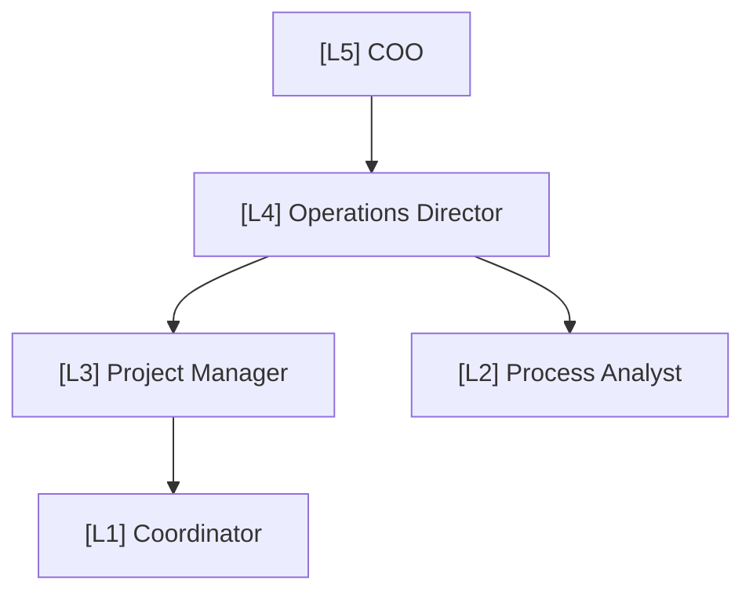

# Operations Department Org Chart

```mermaid
graph TD
    COO["[L5] COO"]
    OD["[L4] Operations Director"]
    PM["[L3] Project Manager"]
    PA["[L2] Process Analyst"]
    CO["[L1] Coordinator"]

    COO --> OD
    OD --> PM & PA
    PM --> CO

    click COO "/roles/executive/coo.md"
    click OD "/roles/operations/director.md"
    click PM "/roles/operations/project-manager.md"
    click PA "/roles/operations/process-analyst.md"
    click CO "/roles/operations/coordinator.md"
```
