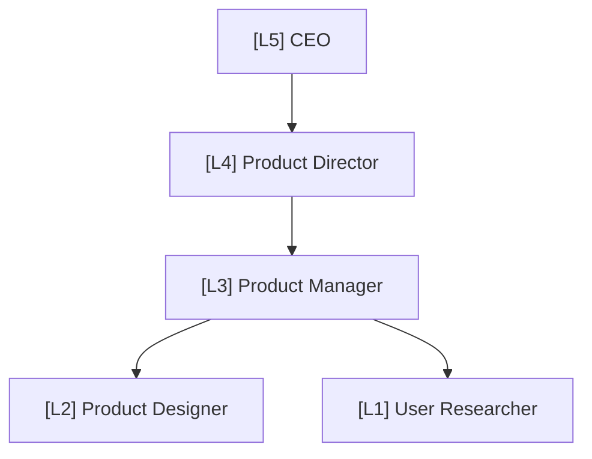

# Product Department Org Chart

```mermaid
graph TD
    CEO["[L5] CEO"]
    PD["[L4] Product Director"]
    PM["[L3] Product Manager"]
    PDes["[L2] Product Designer"]
    UR["[L1] User Researcher"]

    CEO --> PD
    PD --> PM
    PM --> PDes & UR

    click CEO "/roles/executive/ceo.md"
    click PD "/roles/product/director.md"
    click PM "/roles/product/manager.md"
    click PDes "/roles/product/designer.md"
    click UR "/roles/product/user-researcher.md"
```
