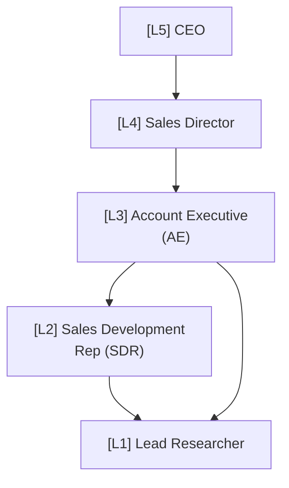

# Sales Department Org Chart

```mermaid
graph TD
    CEO["[L5] CEO"]
    SD["[L4] Sales Director"]
    AE["[L3] Account Executive\n(AE)"]
    SDR["[L2] Sales Development\nRep (SDR)"]
    LR["[L1] Lead Researcher"]

    CEO --> SD
    SD --> AE
    AE --> SDR 
    SDR --> LR
    AE --> LR

    click CEO "/roles/executive/ceo.md"
    click SD "/roles/sales/director.md"
    click AE "/roles/sales/account-executive.md"
    click SDR "/roles/sales/sdr.md"
    click LR "/roles/sales/lead-researcher.md"
```
