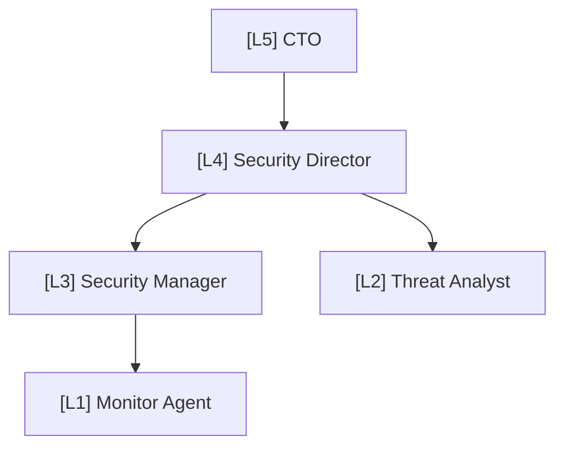

# Security Department Org Chart

```mermaid
graph TD
    CTO["[L5] CTO"]
    SD["[L4] Security Director"]
    SM["[L3] Security Manager"]
    TA["[L2] Threat Analyst"]
    MA["[L1] Monitor Agent"]

    CTO --> SD
    SD --> SM & TA
    SM --> MA

    click CTO "/roles/executive/cto.md"
    click SD "/roles/security/director.md"
    click SM "/roles/security/security-manager.md"
    click TA "/roles/security/threat-analyst.md"
    click MA "/roles/security/monitor-agent.md"
```
