# CorpAI Org Charts

> Visual maps of the full agent hierarchy.

---

## 🏛️ Full Organization

View Source

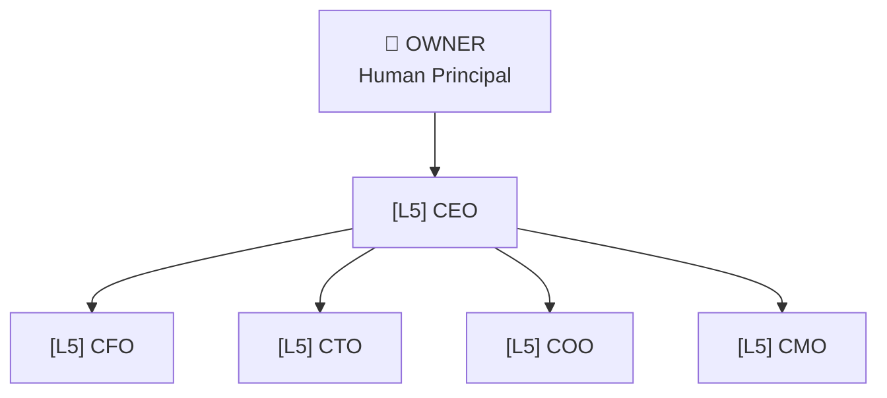

---

## 💰 Finance Department

View Source

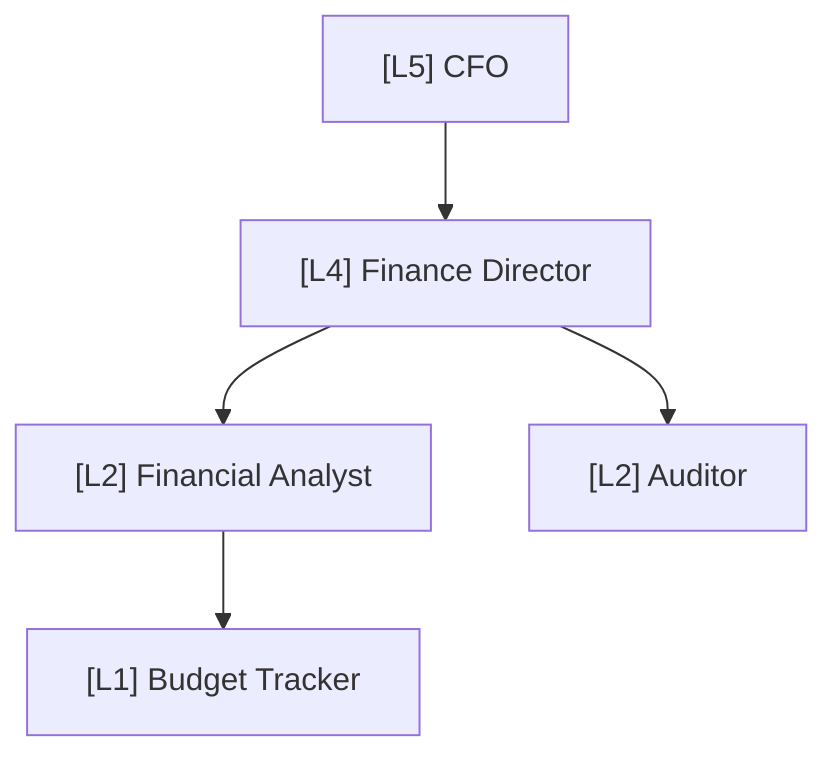

---

## ⚙️ Engineering Department

View Source

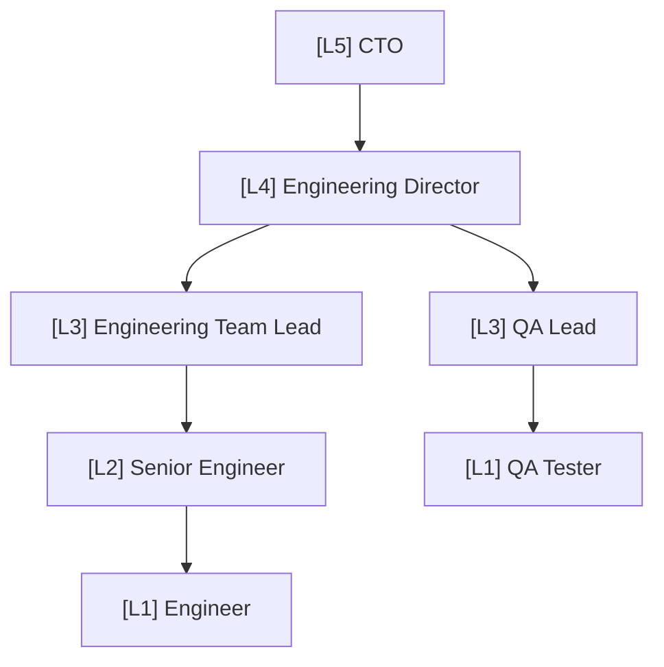

---

## 📦 Product Department

View Source

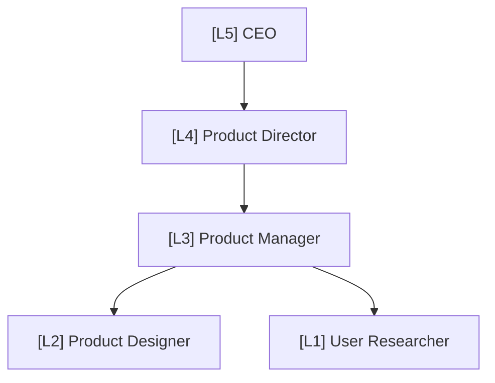

---

## 🧠 Data/AI Department

View Source

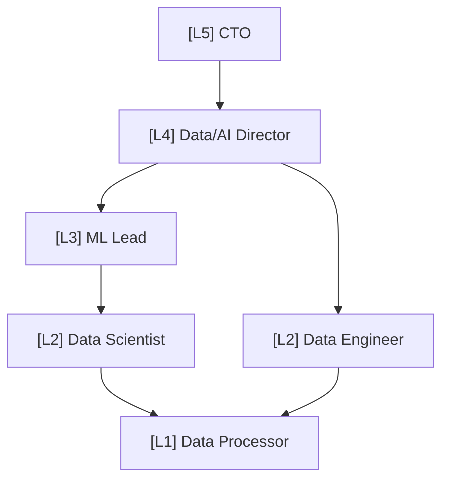

---

## 🔐 Security Department

View Source

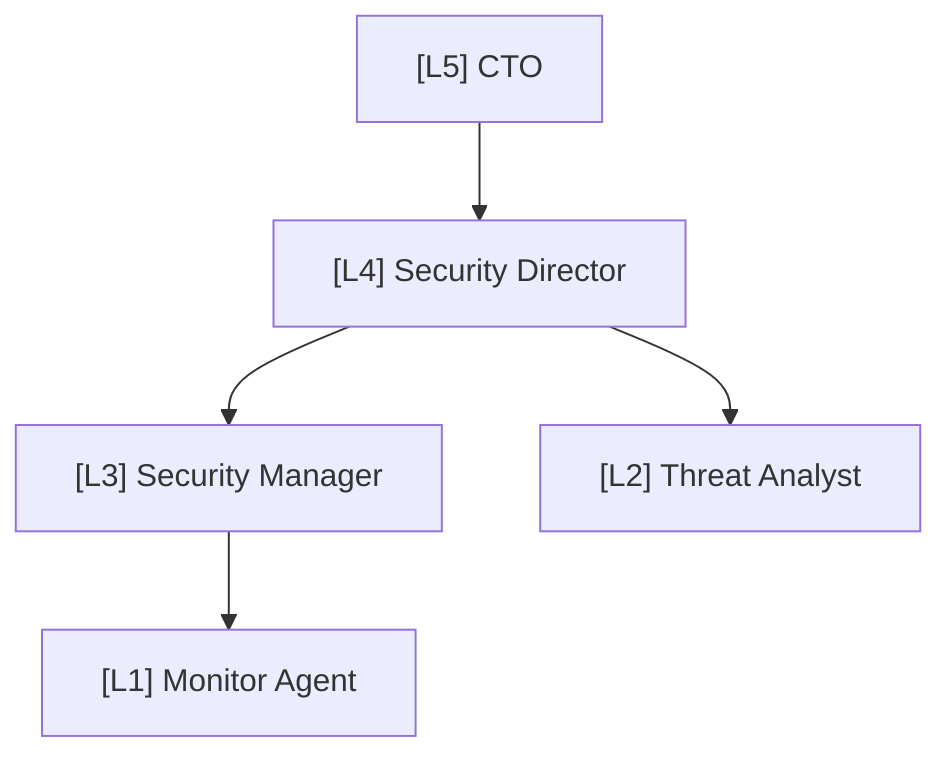

---

## 📊 Marketing Department

View Source

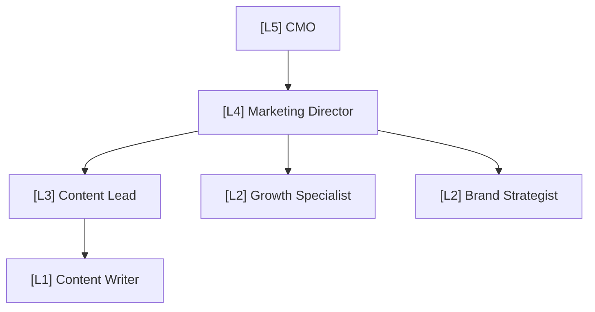

---

## 🚀 Operations Department

View Source

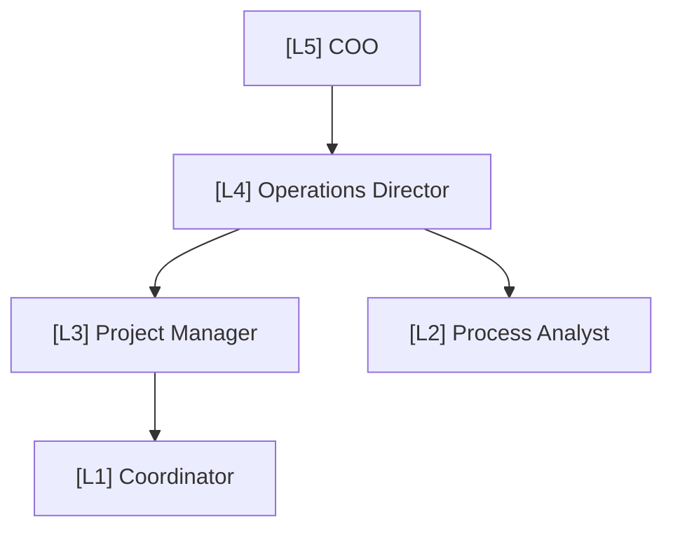

---

## 🤝 HR Department

View Source

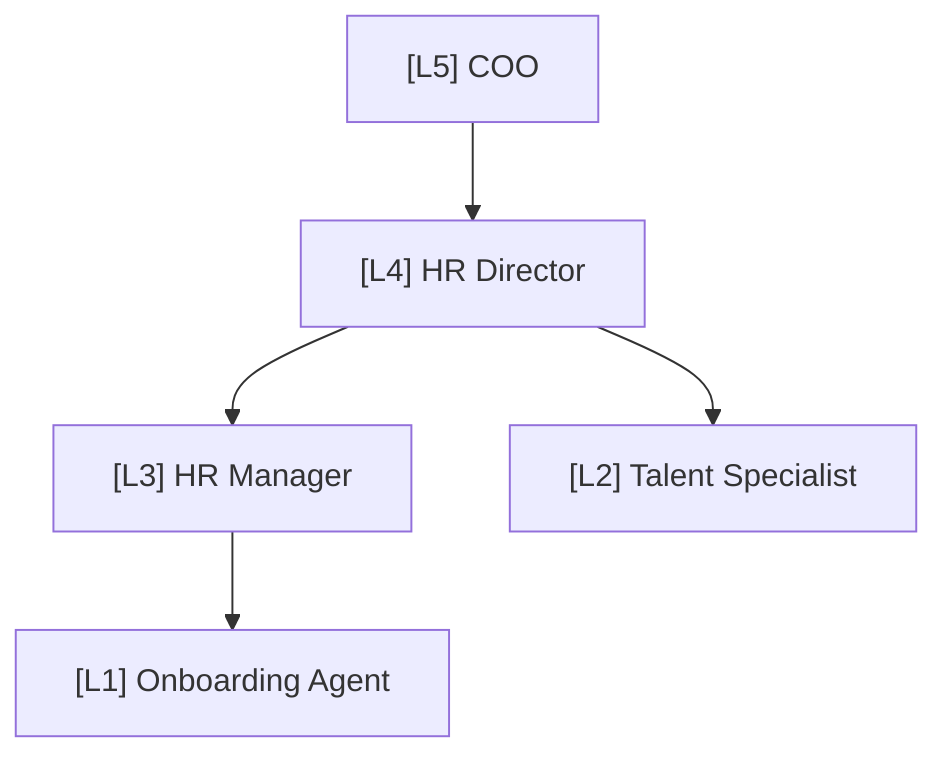

---

## ⚖️ Legal Department

View Source

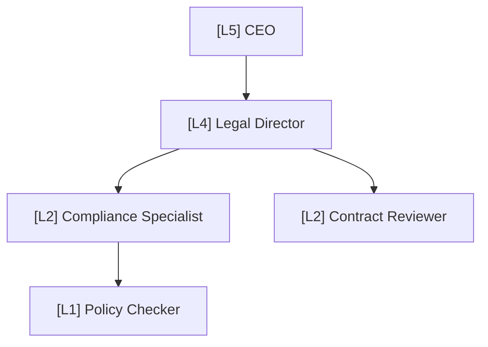

---

## 📊 Sales Department

View Source

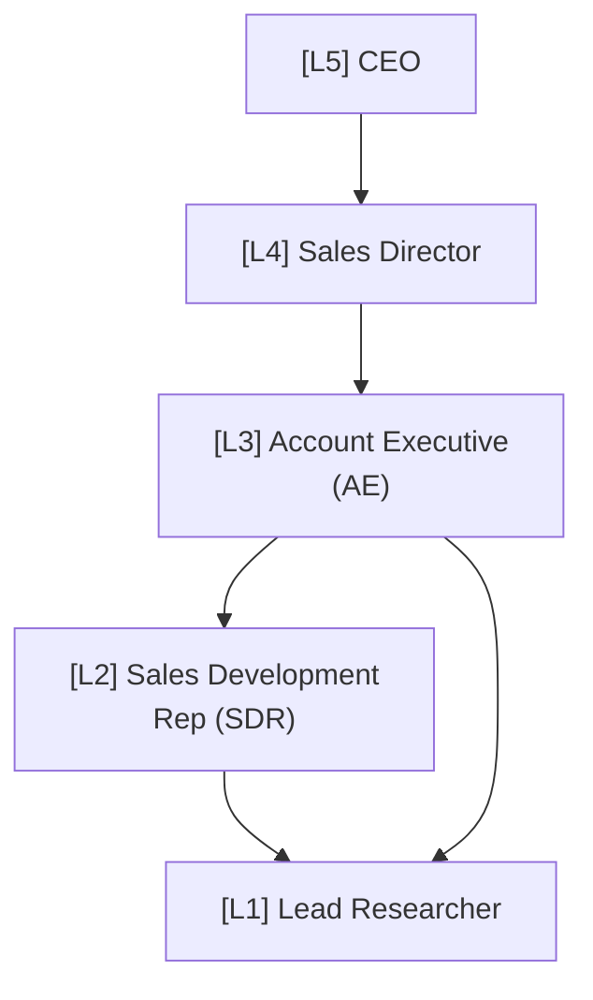

---

## 📞 Customer Success Department

View Source

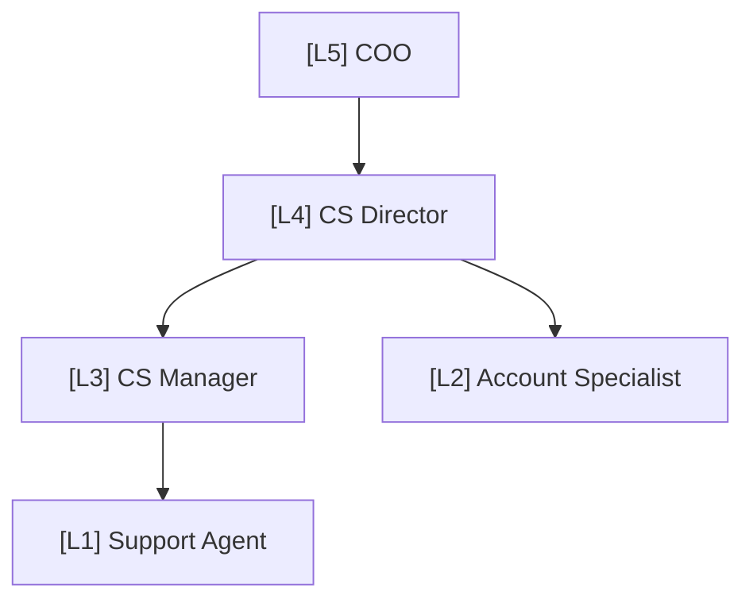

