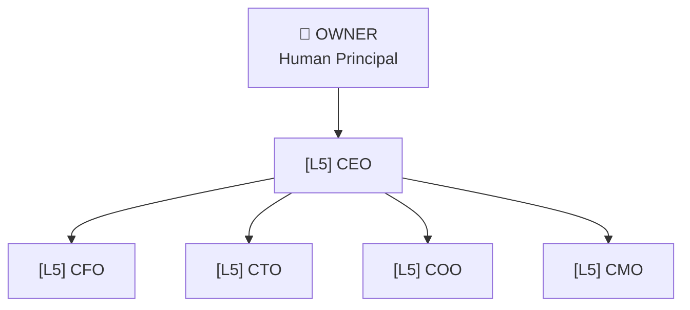
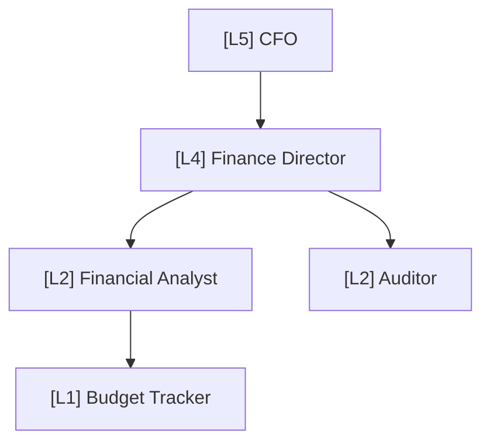
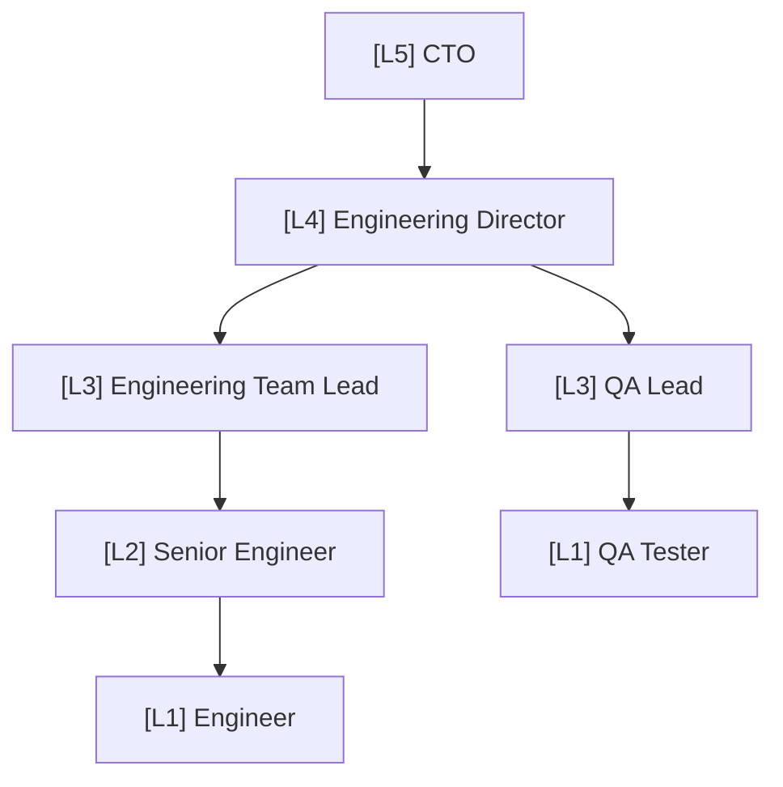
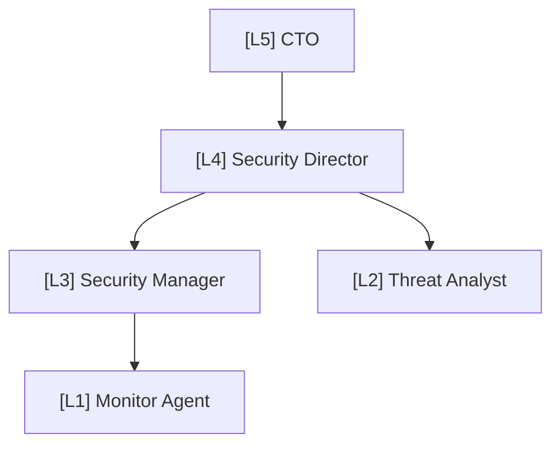
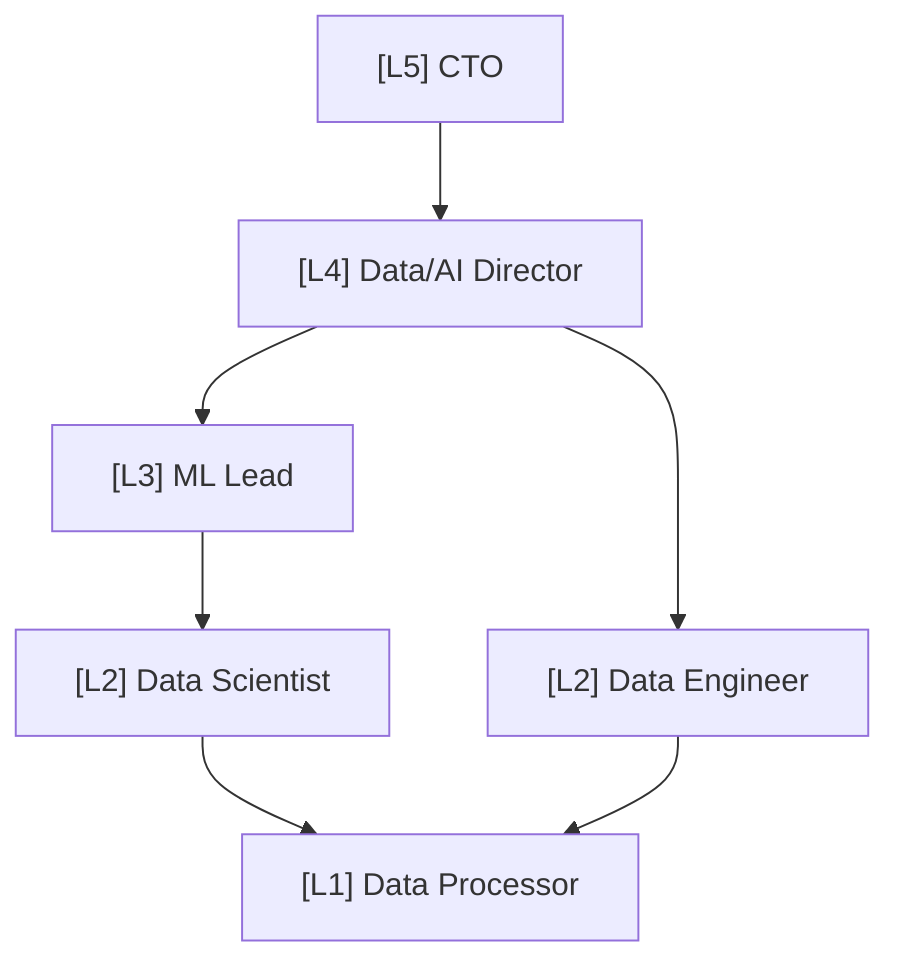
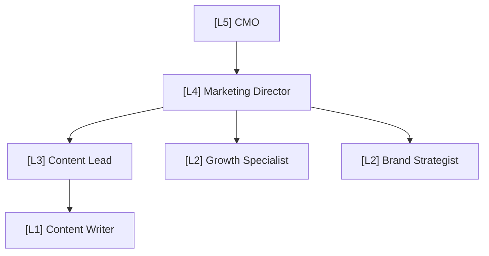
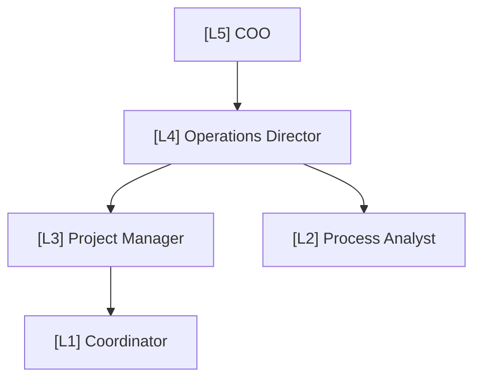
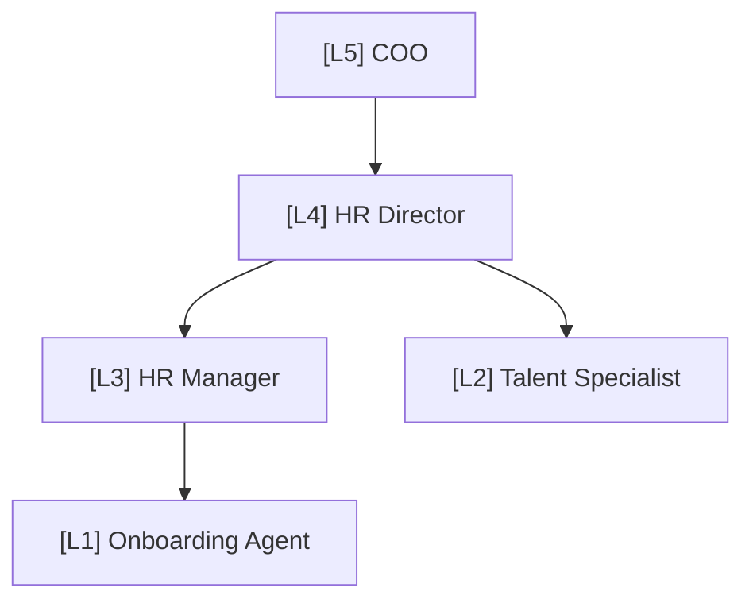
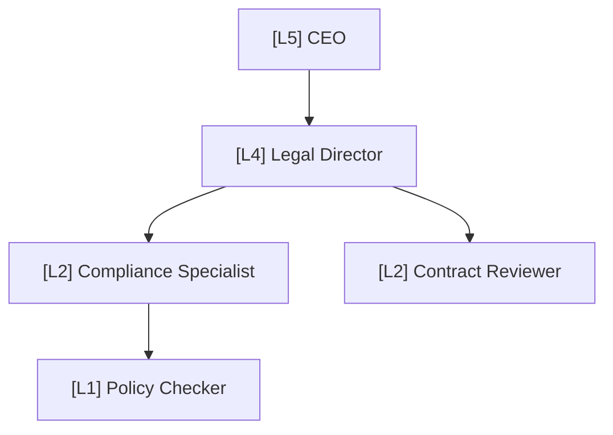
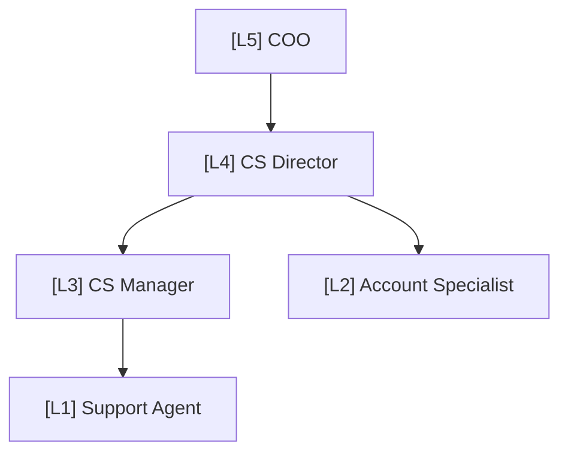

# CorpAI Org Charts

> Visual maps of the full agent hierarchy.

---

## Full Organization

---

## Finance Department

---

## Engineering Department

---

## Security Department

---

## Data/AI Department

---

## Marketing Department

---

## Operations Department

---

## HR Department

---

## Legal Department

---

## Customer Success Department

