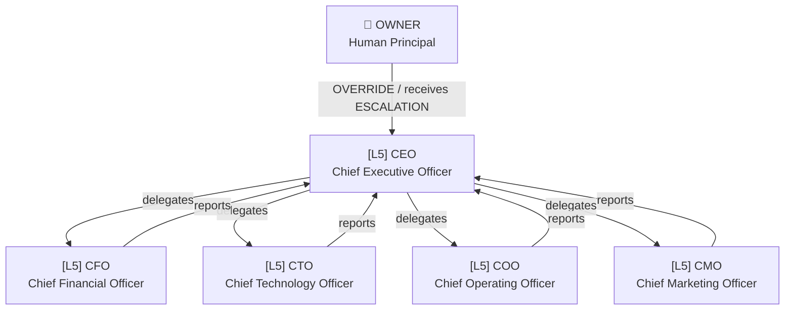

# CorpAI Org Charts

> Visual maps of the agent hierarchy.

---

## v0.1 — Executive Layer

---

## Full Org (Community Contributions)

As departments are added via PRs, their charts will appear here.

- [ ] Engineering department
- [ ] Finance department
- [ ] Marketing department
- [ ] Operations department
- [ ] Legal department
- [ ] HR department
- [ ] Security department
- [ ] Data/AI department
- [ ] Customer Success department

---

## How to Add a Department Chart

1. Add your department's roles in `roles/{department}/`
2. Add a Mermaid diagram block to this file under a new `## {Department}` heading
3. Submit a PR following [CONTRIBUTING.md](../../CONTRIBUTING.md)
