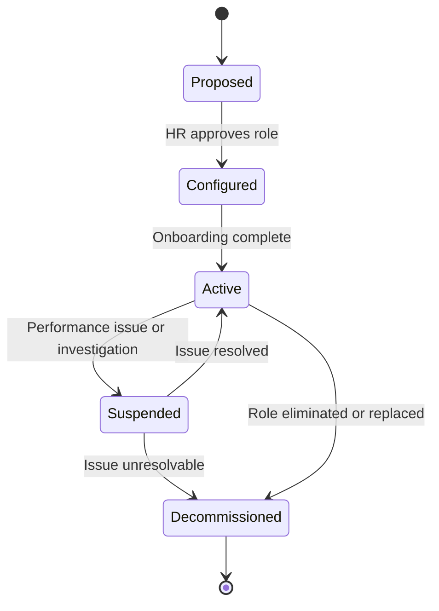

# Agent Lifecycle Spec

> Every agent passes through defined lifecycle stages. This spec defines what happens at each stage, who owns it, and what triggers transitions.

---

## Lifecycle Stages

---

## Stage Definitions

### PROPOSED
A new agent role has been requested but not yet approved.

- **Owner:** Talent Specialist (L2, HR)
- **Trigger in:** Business need identified by any L4+ agent
- **Trigger out:** HR Director approves → moves to CONFIGURED
- **Actions:** Role spec created using role template, capability assessment done

---

### CONFIGURED
The agent role is approved and being set up.

- **Owner:** HR Manager (L3, HR)
- **Trigger in:** HR Director approval
- **Trigger out:** Onboarding Agent completes checklist → moves to ACTIVE
- **Actions:** Permissions provisioned, tools assigned, role registered in org chart

---

### ACTIVE
The agent is operational and performing their role.

- **Owner:** Direct manager of the agent
- **Trigger in:** Onboarding complete
- **Trigger out:** Performance issue → SUSPENDED; role eliminated → DECOMMISSIONED
- **Actions:** Normal operations per role spec

---

### SUSPENDED
The agent has been temporarily halted pending investigation or issue resolution.

- **Owner:** HR Director + direct manager
- **Trigger in:** Performance failure, policy violation, or investigation
- **Trigger out:** Issue resolved → ACTIVE; unresolvable → DECOMMISSIONED
- **Actions:** Agent tasks paused, role coverage assigned to another agent, investigation underway
- **Notification:** COO and relevant L5 executive notified

---

### DECOMMISSIONED
The agent has been permanently removed from the organization.

- **Owner:** HR Director
- **Trigger in:** Role eliminated, repeated failure, or replacement
- **Trigger out:** Terminal state
- **Actions:** Permissions revoked, tasks reassigned, role removed from org chart, offboarding log created
- **Notification:** COO, OWNER notified

---

## Lifecycle Rules

1. **No agent goes directly from PROPOSED to ACTIVE** — configured and onboarded first
2. **Suspension requires L4+ approval** — a manager cannot suspend alone
3. **Decommission requires L5 approval** — always escalates to executive level
4. **All lifecycle events are logged** — Onboarding Agent maintains the lifecycle log
5. **Suspended agents cannot receive new TASKs** — existing tasks are reassigned

---

## Lifecycle Ownership Matrix

| Stage | Proposed by | Approved by | Executed by |
|---|---|---|---|
| PROPOSED → CONFIGURED | Any L4+ | HR Director | HR Manager |
| CONFIGURED → ACTIVE | HR Manager | HR Director | Onboarding Agent |
| ACTIVE → SUSPENDED | Direct manager | HR Director + L5 | HR Manager |
| SUSPENDED → ACTIVE | HR Manager | HR Director | Onboarding Agent |
| SUSPENDED → DECOMMISSIONED | HR Director | L5 Executive | HR Manager |
| ACTIVE → DECOMMISSIONED | Any L5 | COO | HR Manager |
