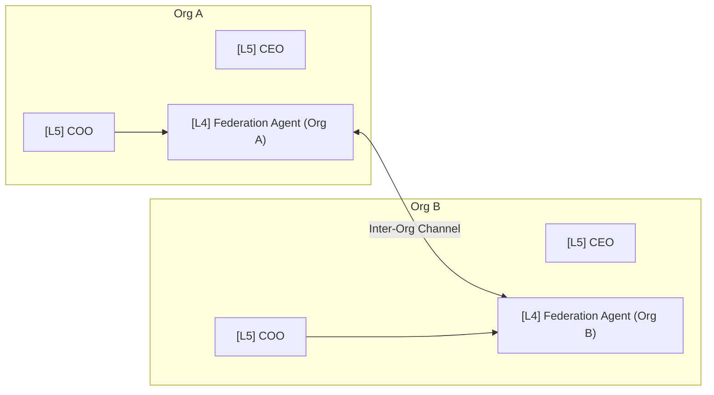
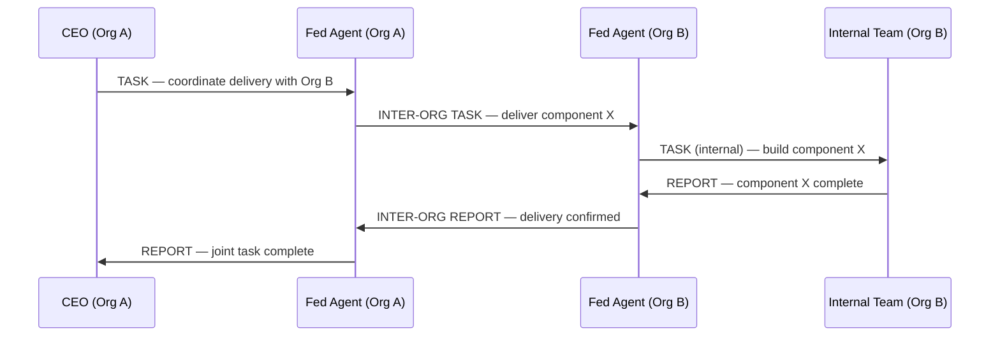
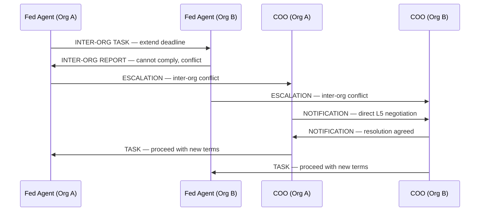

# CorpAI Multi-Org Spec

> When two CorpAI organizations need to work together, they don't merge hierarchies. They establish a **Federation** — a formal inter-org protocol with defined contact points, message contracts, and escalation boundaries.

---

## Core Concept

Each CorpAI org is sovereign. No external org can issue commands inside another org below the agreed contact point. All inter-org communication flows through designated **Federation Agents** at L4 or L5.



---

## Federation Setup

Before two orgs can communicate, they must establish a **Federation Agreement** — a config document both orgs sign off on.

```yaml
# federation.yaml

federation:
  org_a:
    name: "Org Alpha"
    contact_role: "Operations Director"
    contact_rank: L4

  org_b:
    name: "Org Beta"
    contact_role: "Operations Director"
    contact_rank: L4

  allowed_message_types:
    - TASK
    - REPORT
    - NOTIFICATION

  # ESCALATION and OVERRIDE are never allowed cross-org by default
  blocked_message_types:
    - ESCALATION
    - OVERRIDE

  scope:
    - "Joint project: [project name]"
    - "Service: [service name]"

  # Max rank that can receive inter-org messages (no OWNER contact)
  max_inbound_rank: L4

  # How long until federation auto-expires if not renewed
  expiry: "2026-12-31"
```

---

## Federation Agent Role

Each org designates a **Federation Agent** — typically the Operations Director (L4) or COO (L5) depending on scope.

```markdown
## Federation Agent Responsibilities
- Single point of contact for all inter-org messages
- Translates external TASKs into internal org tasks
- Never forwards raw inter-org messages internally — always repackages them
- Reports inter-org activity to their direct manager
- Escalates inter-org conflicts to their L5 executive
```

---

## Inter-Org Message Format

Inter-org messages extend the standard CorpAI message format with federation metadata:

```json
{
  "id": "intorg_msg_id",
  "type": "TASK",
  "federation": {
    "from_org": "Org Alpha",
    "to_org": "Org Beta",
    "agreement_id": "fed_alpha_beta_2026",
    "channel": "operations"
  },
  "from": {
    "role": "Operations Director",
    "rank": "L4",
    "org": "Org Alpha"
  },
  "to": {
    "role": "Operations Director",
    "rank": "L4",
    "org": "Org Beta"
  },
  "timestamp": "ISO-8601",
  "priority": "P3",
  "subject": "Deliver data export by EOD",
  "body": "...",
  "requires_response": true
}
```

---

## Inter-Org Flow Diagrams

### Joint Task Execution


### Inter-Org Conflict


---

## Rules

1. **No org can issue OVERRIDEs to another org.** Sovereignty is absolute.
2. **No org can contact below the federation contact rank.** All inter-org comms go through the Federation Agent.
3. **Escalations stay internal.** An inter-org TASK failure becomes an internal escalation, not an inter-org one.
4. **Federation Agents repackage messages.** They never forward raw inter-org messages internally — they translate them into internal TASKs.
5. **Agreements expire.** All federations have an expiry date and must be renewed.
6. **OWNER is never exposed.** Inter-org comms never reach or reference the OWNER of either org.
